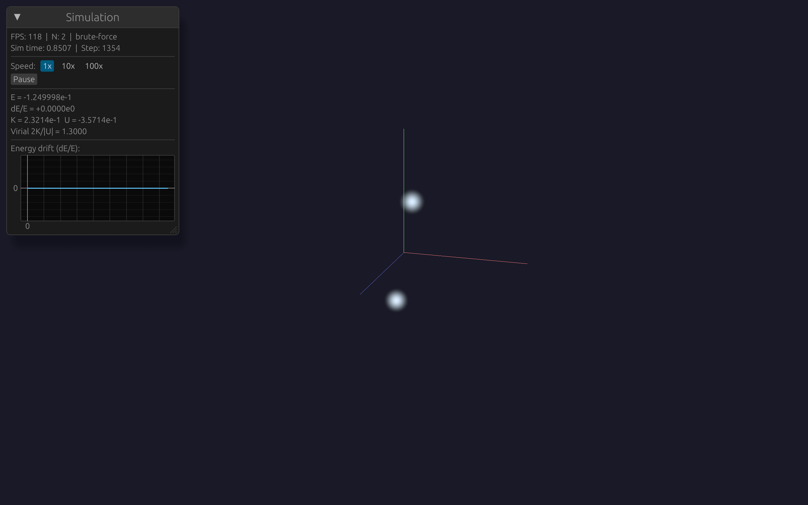

# The N-Body Problem

The gravitational N-body problem is deceptively simple to state: given N point masses interacting through Newtonian gravity, compute their trajectories. It's one of the oldest unsolved problems in physics — for $N \geq 3$, no general closed-form solution exists. Instead, we solve it numerically: compute forces, update velocities and positions, repeat.

This chapter covers the gravitational force law, why we need softening, how to compute forces efficiently, and how to store particle data for performance.

## Newton's Law of Gravitation

The gravitational force on particle $i$ due to particle $j$ is:

$$\vec{F}_{ij} = -\frac{G \, m_i \, m_j}{\left|\vec{r}_{ij}\right|^2} \hat{r}_{ij}$$

where $\vec{r}_{ij} = \vec{r}_j - \vec{r}_i$ is the displacement vector from $i$ to $j$, and $\hat{r}_{ij}$ is its unit vector.

The total force on particle $i$ is the sum over all other particles. We rewrite the expression by absorbing the unit vector $\hat{r}_{ij} = \vec{r}_{ij}/|\vec{r}_{ij}|$ into the denominator — the $1/r^2$ form and the $\vec{r}/r^3$ form are equivalent, but the latter is what we'll actually implement in code since it avoids computing the unit vector separately:

$$\vec{F}_i = \sum_{j \neq i} \vec{F}_{ij} = \sum_{j \neq i} \frac{G \, m_i \, m_j \, \vec{r}_{ij}}{\left|\vec{r}_{ij}\right|^3}$$

Since we need the acceleration $\vec{a}_i = \vec{F}_i / m_i$, the mass $m_i$ cancels from the left side:

$$\vec{a}_i = \sum_{j \neq i} \frac{G \, m_j \, \vec{r}_{ij}}{\left|\vec{r}_{ij}\right|^3}$$

This is what our code computes. For $N$ particles, computing all accelerations requires evaluating $N(N-1)/2$ unique pairs — that's $O(N^2)$ work. At $N = 10{,}000$, that's ~50 million pair interactions per timestep. At $N = 1{,}000{,}000$, it's ~500 billion. This scaling is the central computational challenge, and we'll address it with the Barnes-Hut algorithm in Chapter 3.

## The Singularity Problem

There's a problem lurking in the denominator: $|\vec{r}_{ij}|^3$. As two particles approach each other ($|\vec{r}_{ij}| \to 0$), the force diverges to infinity. In a real stellar system, actual collisions are vanishingly rare — stars are tiny compared to the distances between them. But in a simulation with discrete timesteps, two particles can end up arbitrarily close, producing arbitrarily large forces, which produces arbitrarily large velocities, which flings particles to infinity in a single step.

This isn't just a numerical inconvenience. It's a fundamental limitation of modeling extended objects (stars, dark matter halos) as mathematical point masses.

## Plummer Softening

The standard solution is **gravitational softening**. We replace the point-mass potential with the potential of an extended mass distribution — specifically, a [Plummer sphere](https://en.wikipedia.org/wiki/Plummer_model). The Plummer potential is $\Phi = -GM/\sqrt{r^2 + \epsilon^2}$; our acceleration formula follows from $\vec{a} = -\nabla\Phi$:

$$\vec{a}_i = \sum_{j \neq i} \frac{G \, m_j \, \vec{r}_{ij}}{\left(|\vec{r}_{ij}|^2 + \epsilon^2\right)^{3/2}}$$

The softening length $\epsilon$ sets the scale below which gravity is suppressed. Physically, it means we're treating each point mass as a fuzzy sphere of radius $\sim \epsilon$. At distances $r \gg \epsilon$, the force is indistinguishable from Newtonian. At $r = 0$, the force is zero instead of infinite.

<div class="physics-note">

**Choosing $\epsilon$.**
Too large: you smooth out real gravitational structure. Two particles at distance $d < \epsilon$ barely interact.
Too small: close encounters produce large forces that require tiny timesteps.
Rule of thumb: $\epsilon$ should be comparable to the mean inter-particle spacing at the scale of interest. For a Plummer sphere with $N = 1000$ and scale radius $a = 1$, the [half-mass radius](https://en.wikipedia.org/wiki/Plummer_model) is $\approx 1.3$ (from inverting the Plummer cumulative mass profile), giving a mean spacing of $\sim 0.2$. We use $\epsilon \approx 0.1$, about half the mean spacing.

</div>

## N-Body Units

Rather than carrying $G = 6.674 \times 10^{-11} \; \text{m}^3 \text{kg}^{-1} \text{s}^{-2}$ through every calculation, we choose [N-body units](https://en.wikipedia.org/wiki/N-body_units) where $G = 1$. This is the same idea as [natural units](https://en.wikipedia.org/wiki/Natural_units) in particle physics ($c = \hbar = 1$).

With $G = 1$, $M_{\text{total}} = 1$, and $R_{\text{virial}} = 1$:

- The [**dynamical time**](https://en.wikipedia.org/wiki/Dynamical_time_scale) $t_{\text{dyn}} = \sqrt{R^3 / GM} = 1$
- One time unit $\approx$ one crossing time of the system
- Velocities are in units of the circular velocity at the virial radius

The dynamical time deserves explanation. It's the characteristic timescale of a self-gravitating system — the "heartbeat" at which things happen. Physically, $t_{\text{dyn}}$ is approximately:

- The **free-fall time**: how long a particle at the edge takes to fall to the center under gravity alone
- The **crossing time**: how long a typical particle takes to traverse the system
- The **orbital period** divided by $2\pi$

Nothing interesting happens on timescales much shorter than $t_{\text{dyn}}$, and the system evolves significantly over a few $t_{\text{dyn}}$. By setting $t_{\text{dyn}} = 1$, our timestep `dt = 0.01` means 100 steps per dynamical time — a natural way to think about resolution.

Some concrete values: for a globular star cluster (radius ~10 pc, mass ~$10^5 M_\odot$), $t_{\text{dyn}} \approx 1$ Myr. For a galaxy (radius ~10 kpc, mass ~$10^{11} M_\odot$), $t_{\text{dyn}} \approx 100$ Myr.

To convert our N-body units to physical units for a galaxy simulation: 1 length unit = 1 kpc, 1 mass unit = $10^{10} M_\odot$, 1 time unit $\approx$ 14.9 Myr.

In our code ([`crates/sim-core/src/units.rs`](https://github.com/jcorbettfrank/gravis/blob/main/crates/sim-core/src/units.rs)):

```rust
pub const G: f64 = 1.0;
pub const DEFAULT_SOFTENING: f64 = 0.05;
```

## Why f64?

All simulation quantities use 64-bit floating point (`f64`), which provides ~16 decimal digits of precision. This might seem like overkill — isn't f32 (7 digits) enough for a visual demo?

No. Consider tracking energy conservation over 1000 orbits. The total energy of a two-body Kepler orbit is $E \sim -0.125$. After 1000 orbits with our leapfrog integrator, we measured:

```
dE/E = +2.2e-14   (f64, one orbit — returns to machine precision)
dE/E = +1.4e-12   (f64, ten orbits — round-off random walk)
```

With f32, the baseline noise floor would be ~$10^{-7}$, and after 1000 orbits the accumulated round-off would be ~$10^{-4}$ — the same magnitude as the integrator error we're trying to measure. You can't tell if your physics is wrong or your floats are noisy.

f64 gives us 8 orders of magnitude of headroom between machine precision ($10^{-16}$) and the physics we care about ($10^{-4}$ to $10^{-7}$).

## Data Layout: Structure of Arrays

Before looking at the force calculation code, we need to understand how particles are stored in memory. This is a performance-critical decision.

The naive approach is [**Array of Structs** (AoS)](https://en.wikipedia.org/wiki/AoS_and_SoA):

```rust
// DON'T DO THIS for hot simulation data
struct Particle { x: f64, y: f64, z: f64, vx: f64, vy: f64, vz: f64, mass: f64 }
let particles: Vec<Particle>;
```

In memory: `[x0,y0,z0,vx0,vy0,vz0,m0, x1,y1,z1,vx1,vy1,vz1,m1, ...]`

The gravity inner loop reads positions ($x, y, z$) for all $N$ particles. With AoS, loading $x_i$ also pulls $vx_i, vy_i, vz_i, m_i$ into the cache line — that's wasted bandwidth. On the M5 Pro, cache lines are 64 bytes, holding 8 `f64` values. With AoS, only 3 of those 8 values (the position components) are useful in the force loop.

**Structure of Arrays** (SoA) stores each component contiguously:

```rust
pub struct Particles {
    pub x: Vec<f64>,   // [x0, x1, x2, x3, x4, x5, x6, x7, ...]
    pub y: Vec<f64>,   // [y0, y1, y2, y3, y4, y5, y6, y7, ...]
    pub z: Vec<f64>,   // [z0, z1, z2, z3, z4, z5, z6, z7, ...]
    pub vx: Vec<f64>,
    pub vy: Vec<f64>,
    pub vz: Vec<f64>,
    pub ax: Vec<f64>,
    pub ay: Vec<f64>,
    pub az: Vec<f64>,
    pub mass: Vec<f64>,
    pub count: usize,
}
```

Now every cache line is 100% useful position data. The hardware prefetcher detects the sequential access pattern and loads the next cache line before you need it. This is the layout used in production astrophysics codes (GADGET, SWIFT) and is what we use in [`crates/sim-core/src/particle.rs`](https://github.com/jcorbettfrank/gravis/blob/main/crates/sim-core/src/particle.rs).

## The Brute-Force Algorithm

With the data layout decided, here's the force calculation. The full implementation is in [`crates/sim-core/src/gravity.rs`](https://github.com/jcorbettfrank/gravis/blob/main/crates/sim-core/src/gravity.rs).

The key insight: Newton's third law says $\vec{F}_{ij} = -\vec{F}_{ji}$. So instead of computing all $N^2$ interactions, we compute each *pair* once and apply the force to both particles:

```rust
impl GravitySolver for BruteForce {
    fn compute_accelerations(&self, p: &mut Particles) {
        let eps2 = self.softening * self.softening;
        let n = p.count;

        for i in 0..n {
            for j in (i + 1)..n {
                let dx = p.x[j] - p.x[i];
                let dy = p.y[j] - p.y[i];
                let dz = p.z[j] - p.z[i];

                let r2 = dx * dx + dy * dy + dz * dz + eps2;
                let inv_r3 = 1.0 / (r2 * r2.sqrt());

                let ai_factor = G * p.mass[j] * inv_r3;
                let aj_factor = G * p.mass[i] * inv_r3;

                p.ax[i] += ai_factor * dx;
                p.ay[i] += ai_factor * dy;
                p.az[i] += ai_factor * dz;

                p.ax[j] -= aj_factor * dx;
                p.ay[j] -= aj_factor * dy;
                p.az[j] -= aj_factor * dz;
            }
        }
    }
}
```

Let's trace through this for one pair $(i, j)$:

1. **Displacement**: $\vec{r}_{ij} = (dx, dy, dz)$ points from $i$ toward $j$.
2. **Softened distance**: $r^2 + \epsilon^2$ — the `+ eps2` prevents division by zero.
3. **Inverse cube**: $1/(r^2 + \epsilon^2)^{3/2}$ computed as `1.0 / (r2 * r2.sqrt())`.
4. **Acceleration on $i$**: Points toward $j$ (positive `dx` means $j$ is to the right of $i$, so $i$ is pulled right). Scaled by $m_j$ because heavier masses pull harder.
5. **Acceleration on $j$**: Equal and opposite (`-=`). This is Newton's third law, enforced exactly in code.

<div class="physics-note">

**Why pairwise computation?**
The obvious benefit is **performance**: $N(N-1)/2$ pair evaluations instead of $N(N-1)$. But there's a deeper reason related to momentum conservation.

For brute-force gravity, IEEE 754 floating-point actually guarantees that individual pair forces are exactly antisymmetric: `x[j] - x[i] == -(x[i] - x[j])` and `a * b == b * a`. So even a naive $N^2$ loop (computing each direction independently) conserves momentum to machine precision. Our tests confirm this — both approaches give $|\vec{p}| \sim 10^{-13}$ after 1000 steps.

Where pairwise becomes **essential** is with approximate methods. In Chapter 3, the Barnes-Hut algorithm approximates distant forces using a tree of cluster centers-of-mass. The force on particle $i$ from a distant cluster uses the cluster's aggregate properties, while the force on each cluster member from $i$ is computed individually. These are *different calculations* with different intermediate values, so the IEEE 754 symmetry breaks. Without explicit pairwise bookkeeping (or force symmetrization), momentum drifts.

The same issue arises with GPU parallel reductions, where the order of floating-point additions is non-deterministic — and floating-point addition is [not associative](https://en.wikipedia.org/wiki/Floating-point_arithmetic#Accuracy_problems): `(10^{16} + (-10^{16})) + 1 = 1`, but `10^{16} + ((-10^{16}) + 1) = 0`.

Building the pairwise habit now means our code is correct when we switch to Barnes-Hut, GPU compute, or any other approximate method.

</div>

## The `GravitySolver` Trait

The force calculation is defined behind a Rust **trait** — an interface that specifies *what* a gravity solver does without dictating *how*:

```rust
pub trait GravitySolver {
    fn compute_accelerations(&self, particles: &mut Particles);
}
```

`BruteForce` implements this trait with $O(N^2)$ direct summation. In Chapter 3, `BarnesHut` will implement the same trait with $O(N \log N)$ tree-based approximation. The integrator, diagnostics, and headless runner don't care which implementation they're using — they call `gravity.compute_accelerations(particles)` and get the right answer either way.

This is Rust's approach to polymorphism. The `&dyn GravitySolver` syntax (which appears in the integrator) means "a reference to any type implementing `GravitySolver`," resolved at runtime. No inheritance hierarchies, no virtual base classes — just a flat trait with one method.

## Performance: Where We Stand

Our brute-force implementation on the M5 Pro (single-threaded, release mode), from `cargo bench -p sim-core`:

| N | Time per step | Pairs evaluated | Time per pair |
|---|--------------|----------------|---------------|
| 100 | 14 $\mu$s | 4,950 | 2.8 ns |
| 500 | 358 $\mu$s | 124,750 | 2.9 ns |
| 1,000 | 1.39 ms | 499,500 | 2.8 ns |
| 2,000 | 5.3 ms | 1,999,000 | 2.7 ns |
| 5,000 | 38.9 ms | 12,497,500 | 3.1 ns |

The per-pair cost is remarkably consistent at ~2.8 ns, confirming clean $O(N^2)$ scaling. At N=5000, we see a ~10% per-pair slowdown — the position arrays ($3 \times 5000 \times 8$ bytes = 120 KB) are starting to pressure the M5 Pro's L1 data cache (192 KB per performance core). This gentle degradation will become severe at larger N, which is why Barnes-Hut (a future chapter) matters: it reduces the number of interactions, not just the cost per interaction.

For now, $N = 1{,}000$ at 1.4 ms/step gives ~700 steps/second — fast enough for interactive visualization of small systems and for running our verification tests.

## Reproduce It

```bash
# Run the brute-force gravity benchmarks
cargo bench -p sim-core

# Run a 1000-particle Plummer sphere for 1000 steps, output diagnostics
cargo run -p headless --release -- \
    --scenario plummer -n 1000 --steps 1000 \
    --diag-interval 100 \
    --diag-csv artifacts/benchmarks/m1_plummer_1k_diag.csv
```

## Live Demo

Watch a two-body Kepler orbit evolving in real time — the force law and Plummer softening in action. Drag to orbit the camera, scroll to zoom.

<div class="live-demo">
  <iframe src="demos/two-body.html" width="100%" height="450" loading="lazy"
          title="Live two-body Kepler orbit demo"></iframe>
  <p class="demo-fallback" style="display:none">
    
    <em>Live demo requires a WebGPU-enabled browser (Chrome 113+, Edge 113+, Safari 18+).</em>
  </p>
</div>

## Further Reading

- [Newton's law of universal gravitation](https://en.wikipedia.org/wiki/Newton%27s_law_of_universal_gravitation) — the force law and its history
- [Plummer model](https://en.wikipedia.org/wiki/Plummer_model) — the softened potential, density profile, and half-mass radius derivation
- [N-body units](https://en.wikipedia.org/wiki/N-body_units) — the unit system used throughout this book
- [Gravitational N-body problem](https://en.wikipedia.org/wiki/N-body_problem) — the general problem and why $N \geq 3$ has no closed-form solution
- [AoS and SoA](https://en.wikipedia.org/wiki/AoS_and_SoA) — the data layout patterns and their performance tradeoffs

## What's Next

We have a force calculator, but we haven't said anything about *how* to advance particles in time. The choice of time integrator is surprisingly subtle — a "better" integrator (higher order, more accurate per step) can actually give *worse* results over long simulations. Chapter 2 explains why, and introduces the leapfrog integrator that makes our energy conservation possible.
