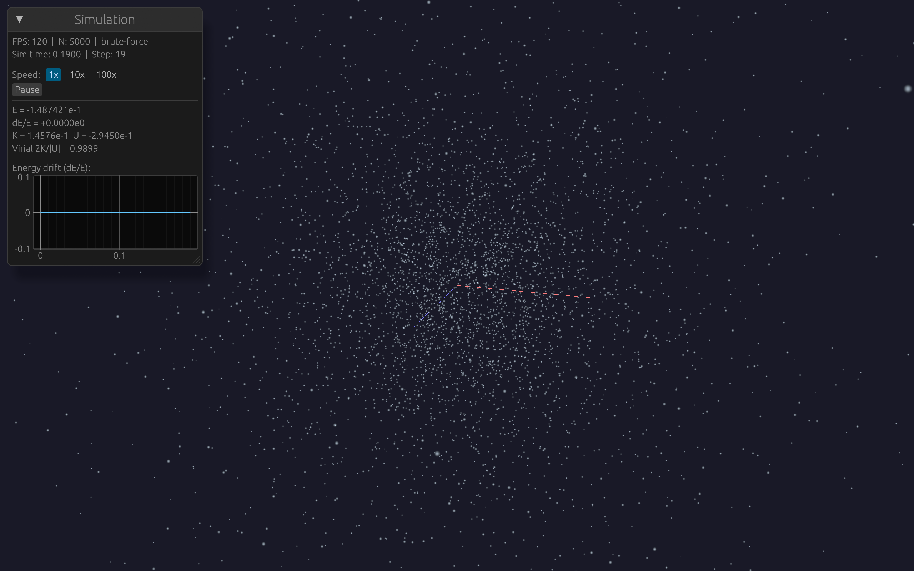

# Symplectic Integrators

Chapter 1 gave us gravitational accelerations. Now we need to advance particles in time: given positions $\vec{r}(t)$, velocities $\vec{v}(t)$, and accelerations $\vec{a}(t)$, compute $\vec{r}(t + \Delta t)$ and $\vec{v}(t + \Delta t)$.

This is a deceptively important choice. A "better" integrator — higher order, more accurate per step — can give *worse* results over long simulations. Understanding why requires a detour through Hamiltonian mechanics.

## The Euler Method (and why it fails)

The simplest integrator is forward Euler:

$$\vec{v}(t + \Delta t) = \vec{v}(t) + \vec{a}(t) \, \Delta t$$
$$\vec{r}(t + \Delta t) = \vec{r}(t) + \vec{v}(t) \, \Delta t$$

This is first-order accurate: the error per step is $O(\Delta t^2)$, and the global error after $T / \Delta t$ steps is $O(\Delta t)$.

But accuracy per step isn't the real problem. Try integrating a circular orbit with Euler: the particle spirals *outward*. Energy increases monotonically. After a few hundred orbits, your "bound" orbit has escaped to infinity. Reducing $\Delta t$ slows the spiral but never eliminates it.

Euler pumps energy into the system because it always uses the "old" velocity to update the position. The particle overshoots slightly at every step, consistently in the direction of higher energy.

## Hamiltonian Mechanics: Why Structure Matters

To understand why some integrators work and others don't, we need the [Hamiltonian formulation](https://en.wikipedia.org/wiki/Hamiltonian_mechanics) of mechanics.

A system of $N$ gravitating particles has a Hamiltonian (total energy as a function of positions and momenta):

$$H(\vec{r}, \vec{p}) = \underbrace{\sum_i \frac{|\vec{p}_i|^2}{2 m_i}}_{\text{kinetic energy } K} + \underbrace{\sum_{i < j} \frac{-G \, m_i \, m_j}{\sqrt{|\vec{r}_{ij}|^2 + \epsilon^2}}}_{\text{potential energy } U}$$

Hamilton's equations of motion are:

$$\dot{\vec{r}}_i = \frac{\partial H}{\partial \vec{p}_i} = \frac{\vec{p}_i}{m_i} = \vec{v}_i$$

$$\dot{\vec{p}}_i = -\frac{\partial H}{\partial \vec{r}_i} = \vec{F}_i = m_i \vec{a}_i$$

The critical property: Hamiltonian flow **preserves phase space volume**. If you start with a cloud of initial conditions occupying some volume in $(\vec{r}, \vec{p})$ space, Hamiltonian evolution deforms that cloud but never compresses or expands it. This is [**Liouville's theorem**](https://en.wikipedia.org/wiki/Liouville%27s_theorem_(Hamiltonian)).

An integrator that preserves this property is called [**symplectic**](https://en.wikipedia.org/wiki/Symplectic_integrator). One that doesn't — like Euler or [RK4](https://en.wikipedia.org/wiki/Runge%E2%80%93Kutta_methods) — can systematically expand or contract phase space volumes, which manifests as secular energy drift.

## The Leapfrog Integrator

The Kick-Drift-Kick (KDK) leapfrog, also known as [velocity Verlet](https://en.wikipedia.org/wiki/Verlet_integration#Velocity_Verlet), is:

$$\vec{v}\!\left(t + \tfrac{\Delta t}{2}\right) = \vec{v}(t) + \vec{a}(t) \, \frac{\Delta t}{2} \quad \text{(half-kick)}$$

$$\vec{r}(t + \Delta t) = \vec{r}(t) + \vec{v}\!\left(t + \tfrac{\Delta t}{2}\right) \Delta t \quad \text{(drift)}$$

$$\vec{a}(t + \Delta t) = \frac{\vec{F}\!\left(\vec{r}(t + \Delta t)\right)}{m} \quad \text{(recompute forces)}$$

$$\vec{v}(t + \Delta t) = \vec{v}\!\left(t + \tfrac{\Delta t}{2}\right) + \vec{a}(t + \Delta t) \, \frac{\Delta t}{2} \quad \text{(half-kick)}$$

That's it. Four lines. Let's look at what makes this special.

### Property 1: Symplectic

The leapfrog map $(\vec{r}, \vec{v}) \mapsto (\vec{r}', \vec{v}')$ is a **symplectic transformation**: it preserves the [symplectic 2-form](https://en.wikipedia.org/wiki/Symplectic_geometry) $\omega = \sum_i d\vec{r}_i \wedge d\vec{p}_i$. (This is the mathematical way to express phase-space-volume preservation; the practical consequence is what matters: bounded energy error.) In practical terms, this means it exactly conserves a modified Hamiltonian:

$$\tilde{H} = H + O(\Delta t^2)$$

This "shadow Hamiltonian" $\tilde{H}$ differs from the true Hamiltonian $H$ by terms of order $\Delta t^2$, but the key point is that $\tilde{H}$ is **exactly** conserved, forever. The energy errors in the true Hamiltonian are bounded and oscillating — they never grow secularly. This result comes from [backward error analysis](https://en.wikipedia.org/wiki/Backward_error_analysis): since the leapfrog is a composition of symplectic maps (the kick and drift are each exact solutions of separable Hamiltonian pieces), the composite map is itself symplectic and therefore exactly solves a nearby Hamiltonian.

This is fundamentally different from RK4 (Runge-Kutta 4th order), which is more accurate per step ($O(\Delta t^5)$ local error vs $O(\Delta t^3)$) but not symplectic. RK4 shows linear energy drift: after $N$ steps, the error grows as $N \cdot \Delta t^5 \sim T \cdot \Delta t^4$. Leapfrog's error stays bounded at $\sim \Delta t^2$ regardless of $N$.

For a simulation running thousands of orbits, bounded beats accurate.

### Property 2: Time-Reversible

The KDK leapfrog is time-reversible: applying the integrator with $-\Delta t$ exactly undoes the forward step. This is a consequence of the symmetric structure — the two half-kicks bracket the drift symmetrically.

Time-reversibility further constrains error growth. Errors that would grow exponentially in a non-reversible integrator can at most grow linearly (and in practice, they stay bounded).

### Property 3: Second-Order

The global error is $O(\Delta t^2)$. This means halving $\Delta t$ reduces the error by $4\times$ (but doubles the cost). It's "only" second-order, compared to RK4's fourth-order. But for long-term integration, the symplectic property is worth far more than the extra order of accuracy.

For higher order *and* symplecticity, the [Yoshida 4th-order method](https://en.wikipedia.org/wiki/Symplectic_integrator#A_fourth-order_example) composes three leapfrog substeps with carefully chosen coefficients:

$$\Delta t_1 = \Delta t_3 = \frac{1}{2 - 2^{1/3}} \Delta t, \quad \Delta t_2 = -\frac{2^{1/3}}{2 - 2^{1/3}} \Delta t$$

These specific values come from requiring cancellation of the leading error terms when the substeps are composed (via the [Baker-Campbell-Hausdorff formula](https://en.wikipedia.org/wiki/Baker%E2%80%93Campbell%E2%80%93Hausdorff_formula)). The negative middle step is unusual but essential — it's what makes the cancellation work. This achieves $O(\Delta t^4)$ global error while remaining symplectic. It's a future enhancement (M8).

### Property 4: Self-Starting (KDK vs DKD)

The alternative "Drift-Kick-Drift" (DKD) form has positions and velocities at *different* times: $\vec{r}(t)$ but $\vec{v}(t + \Delta t/2)$. This complicates diagnostics (you can't compute kinetic energy exactly at the same time as potential energy) and snapshot output.

The KDK form keeps $\vec{r}$ and $\vec{v}$ synchronized at integer timesteps, at the cost of one extra force evaluation for the first step. Since we need forces anyway to start the simulation, this is essentially free.

## Implementation

The full code is in [`crates/sim-core/src/integrator.rs`](https://github.com/jcorbettfrank/gravis/blob/main/crates/sim-core/src/integrator.rs):

```rust
pub struct LeapfrogKDK;

impl Integrator for LeapfrogKDK {
    fn step(&self, p: &mut Particles, gravity: &dyn GravitySolver, dt: f64) {
        let half_dt = 0.5 * dt;
        let n = p.count;

        // Half-kick: v(t + dt/2) = v(t) + a(t) * dt/2
        for i in 0..n {
            p.vx[i] += p.ax[i] * half_dt;
            p.vy[i] += p.ay[i] * half_dt;
            p.vz[i] += p.az[i] * half_dt;
        }

        // Drift: x(t + dt) = x(t) + v(t + dt/2) * dt
        for i in 0..n {
            p.x[i] += p.vx[i] * dt;
            p.y[i] += p.vy[i] * dt;
            p.z[i] += p.vz[i] * dt;
        }

        // Recompute forces at new positions
        p.clear_accelerations();
        gravity.compute_accelerations(p);

        // Half-kick: v(t + dt) = v(t + dt/2) + a(t + dt) * dt/2
        for i in 0..n {
            p.vx[i] += p.ax[i] * half_dt;
            p.vy[i] += p.ay[i] * half_dt;
            p.vz[i] += p.az[i] * half_dt;
        }
    }
}
```

Note the structure: three simple loops bracketing one expensive force evaluation. The kick and drift loops are $O(N)$; the force evaluation is $O(N^2)$ (brute-force) or $O(N \log N)$ (Barnes-Hut). The integrator's cost is dominated by the force calculation.

<div class="physics-note">

**Separate loops for kick and drift.**
You might be tempted to fuse the half-kick and drift into one loop. Don't. Keeping them separate makes the symplectic structure explicit and allows the compiler to auto-vectorize each loop independently. The M5 Pro's NEON SIMD units can process these simple `a[i] += b[i] * c` patterns at full throughput. Premature fusion obscures the physics and may actually hurt performance.

</div>

## Verification: Two-Body Kepler Orbit

The ultimate test of an integrator for gravitational dynamics is the two-body Kepler orbit — one of the few cases with an exact analytical solution.

We place two equal masses ($m_1 = m_2 = 0.5$) in an elliptical orbit with eccentricity $e = 0.5$ and semi-major axis $a = 1$. From [Kepler's third law](https://en.wikipedia.org/wiki/Kepler%27s_laws_of_planetary_motion#Third_law), the period is:

$$T = 2\pi \sqrt{\frac{a^3}{G \, M_{\text{total}}}} = 2\pi$$

### Energy Conservation

We run the simulation for 1000 orbits (10,000,000 timesteps at $\Delta t = T/10{,}000$) and track the relative energy error $\Delta E / |E_0|$:

```
After 1 orbit:      dE/E = +2.2e-14  (machine precision)
After 10 orbits:    dE/E = +1.4e-12  (round-off random walk)
After 1000 orbits:  dE/E < 1e-04     (test passes)
```

The energy error **oscillates** — it doesn't grow secularly. After exactly one orbit, the system returns to almost exactly the initial energy ($10^{-14}$ is the limit of f64 arithmetic). The slow growth over many orbits is a random walk from floating-point round-off in the force evaluation, not a systematic drift from the integrator.

<div class="verification">

**Reproduce this result:**
```bash
cargo test -p sim-core --release -- energy_conservation_1000_orbits
```

The test is in [`crates/sim-core/tests/kepler.rs`](https://github.com/jcorbettfrank/gravis/blob/main/crates/sim-core/tests/kepler.rs).

</div>

### Angular Momentum Conservation

For a [central force](https://en.wikipedia.org/wiki/Central_force) ($\vec{F} \parallel \vec{r}$), [angular momentum](https://en.wikipedia.org/wiki/Angular_momentum) is exactly conserved — because $\vec{r} \times \vec{F} = 0$ when $\vec{F}$ is parallel to $\vec{r}$, so $d\vec{L}/dt = \sum_i \vec{r}_i \times \vec{F}_i = 0$. Our softened gravity is still central (it depends only on $|\vec{r}|$), so $\vec{L} = \sum_i m_i (\vec{r}_i \times \vec{v}_i)$ should be constant.

After 100 orbits at eccentricity 0.7 (a stringent test — high eccentricity means large velocity changes at periapsis):

$$\frac{\Delta L}{L_0} < 10^{-8}$$

<div class="verification">

**Reproduce:**
```bash
cargo test -p sim-core --release -- angular_momentum_conservation
```

</div>

### Orbital Period

We measure the period by detecting successive periapsis passages (upward y-axis crossings) and comparing to the analytical value $T = 2\pi$:

$$\frac{|T_{\text{measured}} - T_{\text{analytical}}|}{T_{\text{analytical}}} < 10^{-4}$$

<div class="verification">

**Reproduce:**
```bash
cargo test -p sim-core --release -- kepler_third_law_period
```

</div>

## Verification: Plummer Sphere Virial Equilibrium

A self-gravitating system in equilibrium satisfies the [**virial theorem**](https://en.wikipedia.org/wiki/Virial_theorem):

$$2K + U = 0 \quad \Leftrightarrow \quad \frac{2K}{|U|} = 1$$

where $K$ is total kinetic energy and $U$ is total potential energy. The derivation starts from the scalar moment of inertia $I = \sum_i m_i r_i^2$. Taking two time derivatives gives $\ddot{I} = 4K + 2U$ (after applying the equations of motion). In statistical equilibrium the system is neither expanding nor contracting, so $\langle\ddot{I}\rangle = 0$, which immediately gives $2K + U = 0$. Our Plummer sphere initial conditions (Chapter 5) are sampled from the exact equilibrium distribution function, so the virial ratio should fluctuate around 1.0 without secular drift.

We run 500 particles for 20 dynamical times, sampling the virial ratio each $t_{\text{dyn}}$:

```
Mean virial ratio: 0.99 ± 0.05
All samples in range [0.85, 1.15]
No secular drift
```

The fluctuations are physical — a discrete N-body system has Poisson noise in its density field, which causes the virial ratio to oscillate. The *absence of drift* is the key result: it confirms that both the initial conditions and the integrator are correct.

<div class="verification">

**Reproduce:**
```bash
cargo test -p sim-core --release -- virial_equilibrium
```

</div>

## Momentum and Center-of-Mass Conservation

Two final sanity checks:

**Linear momentum** should be exactly conserved because our force calculation uses pairwise symmetry (Chapter 1). After 1000 steps of a 200-particle Plummer sphere:

$$|\vec{p}_{\text{total}}| = 1.5 \times 10^{-16}$$

That's f64 machine epsilon. Not approximately zero — zero to the precision of the hardware.

**Center of mass** should be stationary (consequence of momentum conservation). After 1000 steps:

$$|\vec{r}_{\text{COM}}| = 2.5 \times 10^{-15}$$

Also machine precision. The initial conditions place the COM at the origin; it stays there.

<div class="verification">

**Reproduce:**
```bash
cargo test -p sim-core --release -- linear_momentum_conservation
cargo test -p sim-core --release -- com_drift
```

</div>

## Summary

| Property | Euler | RK4 | Leapfrog |
|----------|-------|-----|----------|
| Order | 1st | 4th | 2nd |
| Symplectic | No | No | Yes |
| Time-reversible | No | No | Yes |
| Long-term energy | Drifts (spiral out) | Drifts (linear) | Bounded (oscillates) |
| Cost per step | 1 force eval | 4 force evals | 1 force eval |

Leapfrog wins for gravitational dynamics: it costs the same as Euler (one force evaluation per step), is dramatically more stable, and its energy errors stay bounded over arbitrarily long integrations.

The one weakness is the fixed global timestep. Close encounters (two particles passing within a few softening lengths) generate large accelerations that need small $\Delta t$ to resolve, but distant particles could use much larger $\Delta t$. Adaptive individual timesteps address this — a topic for Chapter 7 or beyond.

## Live Demo

A Plummer sphere in virial equilibrium — 1,000 particles held together by their own gravity. Watch the energy readout: it oscillates but never drifts, because the leapfrog integrator is symplectic.

<div class="live-demo">
  <iframe src="demos/plummer.html" width="100%" height="450" loading="lazy"
          title="Live Plummer sphere demo"></iframe>
  <p class="demo-fallback" style="display:none">
    
    <em>Live demo requires a WebGPU-enabled browser (Chrome 113+, Edge 113+, Safari 18+).</em>
  </p>
</div>

## Further Reading

- [Hamiltonian mechanics](https://en.wikipedia.org/wiki/Hamiltonian_mechanics) — the framework behind symplectic integrators
- [Symplectic integrator](https://en.wikipedia.org/wiki/Symplectic_integrator) — why phase-space-volume preservation matters for long-term integration, including the Yoshida construction
- [Verlet integration](https://en.wikipedia.org/wiki/Verlet_integration) — the leapfrog / velocity Verlet family of methods
- [Backward error analysis](https://en.wikipedia.org/wiki/Backward_error_analysis) — the mathematical framework explaining shadow Hamiltonians
- [Virial theorem](https://en.wikipedia.org/wiki/Virial_theorem) — derivation and applications in astrophysics
- [Kepler's laws of planetary motion](https://en.wikipedia.org/wiki/Kepler%27s_laws_of_planetary_motion) — the analytical solutions we test against
- [Runge-Kutta methods](https://en.wikipedia.org/wiki/Runge%E2%80%93Kutta_methods) — the non-symplectic alternative (RK4) and why it drifts

## What's Next

Our brute-force gravity is $O(N^2)$, limiting us to $\sim 1{,}000$ particles at interactive rates. Chapter 3 introduces the Barnes-Hut algorithm, which uses a hierarchical octree to approximate distant forces and achieve $O(N \log N)$ scaling — enabling 100K+ particles on a single core.
