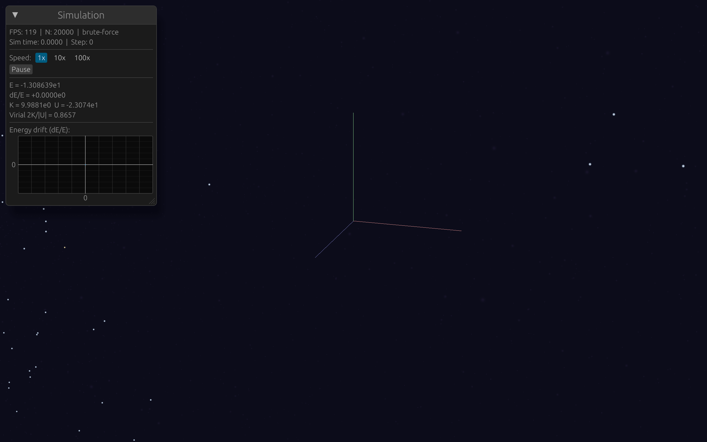

# Galaxy Models & Collisions

Galaxy collisions are the canonical N-body showcase. Two spiral galaxies sweeping past each other, tidal tails streaming outward, dark matter halos interpenetrating invisibly while the stellar disks warp and merge -- it's the problem that launched a thousand thesis projects, and the reason Toomre & Toomre's 1972 paper is one of the most cited in astrophysics.

This chapter covers how we build equilibrium galaxy models from three mass components (disk, bulge, halo), set them on collision courses, and render the result with HDR bloom so dense regions glow instead of clipping to white. By the end, you'll have two multi-component galaxies smashing into each other in your browser.

## Why Galaxy Collisions?

Every technique from the previous chapters converges here. The force calculation (Chapter 1) resolves the tidal field that strips stars from their parent galaxy. The leapfrog integrator (Chapter 2) conserves energy over the hundreds of dynamical times a merger takes. Barnes-Hut (Chapter 3) with Rayon (Chapter 4) makes the $N \sim 100{,}000$ particle counts feasible in real time. The rendering pipeline (Chapter 5) draws it all. Galaxy collisions are the integration test for the entire stack.

They're also physically interesting. Galaxies don't collide like billiard balls -- they're extended, collisionless systems that pass *through* each other. Stars from one galaxy rarely hit stars from the other (the inter-stellar spacing is enormous compared to stellar radii). Instead, the galaxies interact gravitationally: tidal forces strip material from the outskirts, dynamical friction drags the cores together, and the dark matter halos -- invisible but dominant in mass -- reshape the entire encounter.

## Anatomy of a Disk Galaxy

A real spiral galaxy has three gravitationally significant components: a thin rotating disk of stars and gas, a compact central bulge of older stars, and an extended dark matter halo. Our model mirrors this structure.

### The Exponential Disk

The surface density of a stellar disk falls off exponentially with radius:

$$\Sigma(R) = \Sigma_0 \, \exp\!\left(-\frac{R}{R_d}\right)$$

where $R_d$ is the **scale length** -- the radius at which the surface density drops to $1/e$ of its central value. For the Milky Way, $R_d \approx 2.5$ kpc. In our N-body units, $R_d = 1.0$.

The disk has a finite thickness described by a $\text{sech}^2$ vertical profile:

$$\rho(R, z) = \frac{\Sigma(R)}{2 z_0} \, \text{sech}^2\!\left(\frac{z}{z_0}\right)$$

where $z_0$ is the scale height, typically $\sim 0.1 \, R_d$. The $\text{sech}^2$ profile has the nice property that its CDF can be inverted analytically: $z = z_0 \, \text{atanh}(2U - 1)$ for uniform $U$, which makes sampling straightforward.

The enclosed mass of the exponential disk within radius $R$ has a closed-form expression:

$$M_{\text{disk}}(<R) = M_{\text{disk}} \left[1 - \left(1 + \frac{R}{R_d}\right) \exp\!\left(-\frac{R}{R_d}\right)\right]$$

This is used to compute the disk's contribution to the circular velocity at any radius. In the code, we tabulate it for fast interpolation alongside the other components ([`galaxy_collision.rs`](https://github.com/jcorbettfrank/gravis/blob/m5/crates/sim-core/src/scenarios/galaxy_collision.rs)):

```rust
struct DiskMassTable {
    radii: Vec<f64>,
    enclosed: Vec<f64>,
}

impl DiskMassTable {
    fn new(m_disk: f64, scale_radius: f64, max_radius: f64) -> Self {
        let n_bins = 200;
        let r_d = scale_radius;
        // ...
        for i in 0..n_bins {
            let r = max_radius * (i as f64 + 0.5) / n_bins as f64;
            let x = r / r_d;
            // M(<R) = M_total * [1 - (1 + x) * exp(-x)]
            let m = m_disk * (1.0 - (1.0 + x) * (-x).exp());
            // ...
        }
        // ...
    }
}
```

We could evaluate the closed-form expression inline every time, but tabulation makes the circular velocity computation a simple lookup during particle generation -- and the table is only 200 entries, so the memory cost is negligible.

### The Plummer Bulge

The central bulge uses the same Plummer sphere we introduced in [Chapter 1](ch01_gravity.md) for softening. Here it serves double duty: the Plummer potential $\Phi = -GM_b / \sqrt{r^2 + a_b^2}$ gives a smooth central mass concentration, and the Plummer model has an analytical distribution function (DF) that makes velocity sampling exact.

The bulge mass $M_b$ is a fraction of the baryonic mass (default: 30%), and the scale radius $a_b = 0.3$ keeps it compact relative to the disk. The velocity sampling uses the same rejection method from Chapter 1's Plummer sphere scenario -- draw a speed $v = q \cdot v_{\text{esc}}$ where $q$ is sampled from the Plummer DF, then assign a random direction.

### The Dark Matter Halo: Hernquist Profile

The dark matter halo dominates the mass budget. In our default setup, the halo is 10 times the baryonic mass -- roughly consistent with the cosmic baryon fraction. The density profile is:

$$\rho(r) = \frac{M_h}{2\pi} \frac{a_h}{r \, (r + a_h)^3}$$

This is the [Hernquist profile](https://en.wikipedia.org/wiki/Hernquist_profile), and we chose it over the more commonly cited [NFW profile](https://en.wikipedia.org/wiki/Navarro%E2%80%93Frenk%E2%80%93White_profile) for two practical reasons.

**Finite total mass.** The NFW density $\rho_{\text{NFW}} \propto 1/[r(r + r_s)^2]$ falls off as $1/r^3$ at large radius, which means the enclosed mass $M(<r) \propto \ln(1 + r/r_s)$ diverges logarithmically. You *must* impose a truncation radius, and the total mass depends on where you truncate. The Hernquist profile falls off as $1/r^4$, giving a convergent total mass $M_h$ without any truncation. This simplifies the code and eliminates an arbitrary parameter.

**Analytical CDF.** The Hernquist enclosed mass is:

$$M(<r) = M_h \frac{r^2}{(r + a_h)^2}$$

This CDF can be inverted to sample radii directly:

$$r = a_h \frac{\sqrt{U}}{1 - \sqrt{U}}$$

where $U$ is a uniform random number in $(0, 1)$. No rejection sampling needed -- every random number produces a valid radius. The NFW CDF involves a logarithm that can't be inverted analytically, requiring numerical root-finding or rejection sampling.

In code ([`galaxy_collision.rs`](https://github.com/jcorbettfrank/gravis/blob/m5/crates/sim-core/src/scenarios/galaxy_collision.rs)):

```rust
// Hernquist CDF: M(<r)/M = r²/(r+a)²
// Inversion: r = a * √U / (1 - √U)
let u: f64 = rng.random_range(0.001..u_max);
let sqrt_u = u.sqrt();
let r = a * sqrt_u / (1.0 - sqrt_u);
```

The truncation at `u_max` clips the halo at 30 N-body length units (6 scale radii), which contains 97% of the total mass. Particles beyond this radius would have little gravitational influence but would expand the bounding box and increase Barnes-Hut tree depth.

<div class="physics-note">

**Hernquist vs NFW in the inner region.**
Where it matters most -- inside a few scale radii -- the Hernquist and NFW profiles are nearly identical. Both have $\rho \propto 1/r$ cusps at the center and produce flat-ish rotation curves at intermediate radii. The difference is in the outer halo ($r \gg a_h$), where Hernquist falls as $r^{-4}$ and NFW as $r^{-3}$. For a galaxy collision, the outer halo is stripped early and its exact profile is less important than getting the inner potential well right. The Hernquist profile gives us that with simpler code.

</div>

## The Combined Rotation Curve

Each component contributes to the circular velocity $V_c(R) = \sqrt{G \, M_{\text{enclosed}}(R) / R}$ at radius $R$ in the disk plane. Since the components are independent potentials, their contributions add in quadrature:

$$V_c^2(R) = V_{\text{disk}}^2(R) + V_{\text{bulge}}^2(R) + V_{\text{halo}}^2(R)$$

Each term uses the enclosed mass for its component:

**Disk:** $V_{\text{disk}}^2 = G \, M_{\text{disk}}(<R) / R$ (from the tabulated enclosed mass)

**Plummer bulge:** $V_{\text{bulge}}^2 = G \, M_b \, R^2 / (R^2 + a_b^2)^{3/2}$

**Hernquist halo:** $V_{\text{halo}}^2 = G \, M_h \, R / (R + a_h)^2$

In code:

```rust
fn circular_velocity(
    r: f64,
    m_bulge: f64, bulge_a: f64,
    m_halo: f64, halo_a: f64,
    disk_mass_table: &DiskMassTable,
) -> f64 {
    // Disk contribution: V_c² = G * M_disk(<R) / R
    let v2_disk = G * disk_mass_table.enclosed_mass(r) / r;

    // Plummer bulge: V_c² = G * M_b * R² / (R² + a²)^(3/2)
    let v2_bulge = G * m_bulge * r * r
        / (r * r + bulge_a * bulge_a).powf(1.5);

    // Hernquist halo: V_c² = G * M_h * R / (R + a)²
    let v2_halo = G * m_halo * r / ((r + halo_a) * (r + halo_a));

    (v2_disk + v2_bulge + v2_halo).sqrt()
}
```

The resulting rotation curve is roughly flat beyond a few disk scale lengths -- the halo dominates at large $R$, propping up the rotation speed even as the disk and bulge contributions fall off. This is the classic observational signature of dark matter.

## Setting Up Initial Conditions

Getting the initial conditions right is the difference between a galaxy that holds together for hundreds of dynamical times and one that flies apart in the first orbit.

### Disk Particles

Disk particles are the most constrained. They must orbit in the combined potential with approximately circular velocities, plus enough random motion (velocity dispersion) to prevent the disk from collapsing to a ring.

**Radial sampling** uses rejection sampling against the surface density weighted by the area element, $R \cdot \Sigma(R) \propto R \cdot e^{-R/R_d}$. The maximum of $x \, e^{-x}$ occurs at $x = 1$ (i.e., $R = R_d$), which sets the rejection envelope.

**Azimuthal and vertical** positions are straightforward: uniform $\phi \in [0, 2\pi)$, and the $\text{sech}^2$ CDF inversion for $z$.

**Velocities** are the critical part. The tangential velocity is set to the circular velocity from the combined rotation curve, with a small radial dispersion $\sigma_R \approx 0.15 \, V_c$ for [Toomre stability](https://en.wikipedia.org/wiki/Toomre_stability_criterion). The azimuthal dispersion is half the radial (epicyclic approximation), and the vertical dispersion $\sigma_z \approx 0.1 \, V_c$ supports the disk thickness:

```rust
// Circular velocity from combined potential
let v_c = circular_velocity(r, m_bulge, bulge_a, m_halo, halo_a, &disk_mass_table);

// Radial dispersion σ_R ≈ 0.15 * V_c (Toomre stability)
let sigma_r = 0.15 * v_c;
let v_r: f64 = rng.random_range(-1.0..1.0) * sigma_r;
let v_phi = v_c + rng.random_range(-1.0..1.0) * sigma_r * 0.5;

// Vertical dispersion
let sigma_z = 0.1 * v_c;
let v_z: f64 = rng.random_range(-1.0..1.0) * sigma_z;
```

<div class="physics-note">

**Toomre stability.**
A cold, thin disk is violently unstable to axisymmetric perturbations. [Toomre's criterion](https://en.wikipedia.org/wiki/Toomre_stability_criterion) says the disk is stable when $Q = \sigma_R \kappa / (3.36 \, G \, \Sigma) > 1$, where $\kappa$ is the epicyclic frequency and $\Sigma$ the surface density. Our dispersion of $0.15 \, V_c$ gives $Q \sim 1.5$ at $R = 2 R_d$, which is comfortably stable without being so hot that the disk puffs up into an ellipsoid. Production codes solve the Jeans equations to get self-consistent dispersions; our approximation is adequate for visual demos.

</div>

### Halo Particles

Halo particles are simpler: they're distributed isotropically. The position sampling uses the Hernquist CDF inversion described above, with a uniform random direction on the sphere.

For velocities, we use the **isothermal sphere approximation**: the velocity dispersion at radius $r$ is $\sigma(r) = V_c(r) / \sqrt{2}$, with three independent Gaussian components (isotropic). This follows from the Jeans equation for a self-gravitating spherical system with an isotropic velocity distribution and a flat rotation curve: the radial velocity dispersion satisfies $\sigma_r^2 = V_c^2 / 2$. With isotropy, all three components share this value, giving $\sigma = V_c / \sqrt{2}$.

The velocities are sampled via the [Box-Muller transform](https://en.wikipedia.org/wiki/Box%E2%80%93Muller_transform):

```rust
let v_c = circular_velocity(r, m_bulge, bulge_a, m_halo, halo_a, &disk_mass_table);
let sigma = v_c / 2.0_f64.sqrt();

let (g1, g2) = box_muller(rng);
let (g3, _) = box_muller(rng);

let vx = sigma * g1;
let vy = sigma * g2;
let vz = sigma * g3;
```

This is an approximation -- the exact distribution function for a Hernquist profile embedded in a multi-component potential would require solving Eddington's formula numerically. The virial approximation produces halos that are stable for tens of dynamical times, which is more than sufficient for a collision that develops structure within 5-10 $t_{\text{dyn}}$.

### Mass Budget

The default galaxy has:

| Component | Mass fraction | N fraction | Scale radius |
|-----------|--------------|------------|--------------|
| Disk | 0.058 ($M_b \times 0.7$) | ~6% | $R_d = 1.0$ |
| Bulge | 0.025 ($M_b \times 0.3$) | ~2.5% | $a_b = 0.3$ |
| Halo | 0.833 ($10 \times M_b$) | ~91.5% | $a_h = 5.0$ |

The particle counts are proportional to the mass fractions, so most particles are dark matter. This reflects reality -- dark matter outmasses baryons roughly 6:1 in the universe.

## Cold Collapse

Before galaxies, we have a simpler but visually dramatic scenario: **cold collapse**. Take a uniform density sphere, set all velocities to zero, and let gravity do its thing.

The analytical free-fall time for a uniform sphere is:

$$t_{ff} = \frac{\pi}{2} \sqrt{\frac{R^3}{2 \, G \, M}}$$

This is the time for a particle at the sphere's edge to reach the center under free-fall. In N-body units ($G = M = R = 1$), $t_{ff} = \pi / (2\sqrt{2}) \approx 1.11$.

What happens is violent. All particles fall inward, the density at the center spikes, particles overshoot and fly out the other side (shell crossing), then fall back again. After a few bounces, the system undergoes [violent relaxation](https://en.wikipedia.org/wiki/Violent_relaxation) and settles into a quasi-equilibrium virialized state. The final configuration looks nothing like the initial uniform sphere -- it's centrally concentrated, roughly following a $r^{-4}$ density profile.

The code is minimal ([`cold_collapse.rs`](https://github.com/jcorbettfrank/gravis/blob/m5/crates/sim-core/src/scenarios/cold_collapse.rs)): sample uniform positions in a sphere via rejection (reject points outside the unit sphere), set all velocities to zero, done. The softening length is set to 30% of the mean inter-particle spacing, and the timestep resolves 200 steps per free-fall time.

Cold collapse is a great stress test for the integrator. The forces change rapidly during the collapse phase, and any energy error will show up immediately as a different bounce height.

## Galaxy Collision Setup

With two equilibrium galaxies in hand, we place them on a collision course. The collision geometry is controlled by three parameters:

- **Separation**: initial distance between galaxy centers (default: 15 N-body units)
- **Impact parameter**: perpendicular offset (default: 2.0)
- **Approach velocity**: relative speed at the initial separation (default: 0.5)

Galaxy 1 is offset to $(-d/2, -b/2, 0)$ with velocity $(+v/2, 0, 0)$, and Galaxy 2 to $(+d/2, +b/2, 0)$ with velocity $(-v/2, 0, 0)$. Both are then shifted to the center-of-mass frame to eliminate bulk drift.

The impact parameter $b$ controls the encounter geometry:
- $b = 0$: head-on collision (maximally disruptive, no angular momentum)
- $b \sim R_d$: grazing encounter (tidal tails develop, nuclei may merge or fly apart)
- $b \gg R_d$: distant flyby (gentle tidal perturbation, no merger)

### Tidal Dynamics

The physics of tidal stripping is intuitive once you think about it from the right frame. Consider a star at radius $R$ from its parent galaxy's center, with the other galaxy at distance $D$. The star feels gravity from its own galaxy (pulling it in) and from the other galaxy (pulling it away). At the [tidal radius](https://en.wikipedia.org/wiki/Tidal_force) $r_t$, these forces balance:

$$\frac{G \, m_{\text{own}}}{r_t^2} \approx \frac{G \, M_{\text{other}}}{D^2} \cdot \frac{2 r_t}{D}$$

Stars beyond $r_t$ are stripped. As $D$ decreases during the encounter, $r_t$ shrinks, and more material is pulled free. The stripped stars form the tidal tails -- long, thin streams that trace the orbit of the encounter. The leading tail (from the near side, pulled toward the companion) and the trailing tail (from the far side, flung outward by angular momentum) are the visual signatures of a galaxy merger.

<div class="physics-note">

**Dynamical friction.**
When two massive halos pass through each other, the trailing density wake from each halo's passage exerts a gravitational drag on the other. This is [dynamical friction](https://en.wikipedia.org/wiki/Dynamical_friction), and it causes the galaxies to lose orbital energy and eventually merge. The timescale depends on the mass ratio and impact parameter. In our default setup (equal-mass, $b = 2$), the first close passage happens around $t \approx 15$, with merger typically completing by $t \approx 40$. Our simulation captures this naturally -- no special friction formula is needed, because the N-body particles self-consistently generate the wake.

</div>

## HDR Rendering and Bloom

With up to $100{,}000$ particles additively blending, the core of a galaxy easily produces pixel values of 10, 50, or even 100 -- far above the 0-1 range of an LDR display. Without HDR handling, the entire central region clips to solid white, and all structural detail is lost.

The solution is a three-stage pipeline: render to HDR, extract and blur bright regions, then tone map to LDR.

### Step 1: Render to Rgba16Float

Instead of rendering directly to the swap chain surface (which is typically Bgra8Unorm), we render particles to an intermediate texture in `Rgba16Float` format. This 16-bit half-float format stores values up to $\sim 65{,}000$ with 3-4 digits of precision -- more than enough to accumulate additive particle blending without clipping.

The particle pipeline from [Chapter 5](ch05_rendering.md) is unchanged except for the render target format. The additive blending ($\text{SrcAlpha} + \text{One}$) naturally accumulates brightness in the HDR buffer.

### Step 2: Bloom

Bloom simulates the optical effect of bright light scattering in a camera lens or the human eye. It's a three-pass post-process on the HDR buffer ([`bloom.rs`](https://github.com/jcorbettfrank/gravis/blob/m5/crates/render-core/src/bloom.rs)):

**Pass 1 -- Threshold.** Extract pixels whose luminance exceeds a threshold (0.8 by default). The luminance is computed using the standard perceptual weights: $L = 0.2126 R + 0.7152 G + 0.0722 B$. Pixels below the threshold contribute nothing.

```wgsl
@fragment
fn fs_threshold(in: VertexOutput) -> @location(0) vec4<f32> {
    let color = textureSample(t_input, s_input, in.uv);
    let luminance = dot(color.rgb, vec3<f32>(0.2126, 0.7152, 0.0722));
    let contribution = max(luminance - params.threshold, 0.0);
    let scale = contribution / max(luminance, 0.001);
    return vec4<f32>(color.rgb * scale, 1.0);
}
```

**Pass 2 & 3 -- Separable Gaussian blur.** A 2D Gaussian blur with a $9 \times 9$ kernel would require $81$ texture samples per pixel. By exploiting the separable property of the Gaussian ($G_{2D}(x,y) = G_{1D}(x) \cdot G_{1D}(y)$), we split it into a horizontal pass and a vertical pass, each requiring only 9 samples -- a reduction from $O(k^2)$ to $O(k)$.

The blur operates at **half resolution** to widen the effective blur radius and reduce fill rate by 4x. The 9-tap kernel with $\sigma \approx 2.0$ at half resolution acts like an 18-tap kernel at full resolution, giving a soft wide glow.

```wgsl
@fragment
fn fs_blur(in: VertexOutput) -> @location(0) vec4<f32> {
    // 9-tap Gaussian kernel (sigma ≈ 2.0)
    let weights = array<f32, 5>(
        0.227027, 0.1945946, 0.1216216, 0.054054, 0.016216
    );
    // ... sample center + 4 taps in each direction
}
```

**Pass 4 -- Composite.** The blurred bloom texture is added back to the original HDR scene with a configurable intensity (default: 0.3):

$$\text{output} = \text{scene} + \text{intensity} \times \text{bloom}$$

### Step 3: ACES Tone Mapping

The composited HDR image must be compressed to the $[0, 1]$ range for display. We use the [ACES filmic tone mapping](https://en.wikipedia.org/wiki/Academy_Color_Encoding_System) curve ([`tonemap.rs`](https://github.com/jcorbettfrank/gravis/blob/m5/crates/render-core/src/tonemap.rs)):

$$f(x) = \frac{x(2.51x + 0.03)}{x(2.43x + 0.59) + 0.14}$$

ACES has a gentle shoulder that compresses bright values without hard clipping, a toe that lifts dark values slightly, and a roughly linear midtone region. The result looks like a properly exposed photograph rather than a clipped-or-dim simulation.

```wgsl
fn aces_tonemap(x: vec3<f32>) -> vec3<f32> {
    let a = 2.51; let b = 0.03;
    let c = 2.43; let d = 0.59; let e = 0.14;
    return clamp(
        (x * (a * x + b)) / (x * (c * x + d) + e),
        vec3<f32>(0.0), vec3<f32>(1.0)
    );
}
```

The full render pipeline per frame is: particle draw (to HDR) -> bloom (threshold, blur H, blur V, composite) -> tone map (to surface). That's 6 render passes total, but the bloom passes run at half resolution and use trivial fullscreen-triangle shaders, so the GPU cost is modest.

## Per-Particle Coloring

With three distinct physical components, we want them visually distinguishable. Each particle carries a `ParticleType` tag ([`particle.rs`](https://github.com/jcorbettfrank/gravis/blob/m5/crates/sim-core/src/particle.rs)):

```rust
#[repr(u8)]
pub enum ParticleType {
    Default = 0,
    DiskStar = 1,
    BulgeStar = 2,
    DarkMatter = 3,
}
```

The color mapping in [`color.rs`](https://github.com/jcorbettfrank/gravis/blob/m5/crates/render-core/src/color.rs) assigns:

| Component | Color | Rationale |
|-----------|-------|-----------|
| DiskStar | Blue-white $(0.6, 0.75, 1.0)$ | Young stellar populations are hot and blue |
| BulgeStar | Yellow-orange $(1.0, 0.8, 0.4)$ | Old stellar populations are cool and red |
| DarkMatter | Dim purple $(0.3, 0.2, 0.5)$ at $\alpha = 0.15$ | Visible for debugging, dim enough to not dominate |

The dark matter particles render at 15% opacity, so the halo is a faint purple fog surrounding the bright stellar core. During a collision, you can see the two halos interpenetrate smoothly while the stellar tails stream dramatically behind -- a visual reminder that dark matter is collisionless and barely notices the encounter, while the baryonic disks are torn apart.

## Putting It Together

The `GalaxyCollision` scenario ties everything together in a single `Scenario` implementation ([`galaxy_collision.rs`](https://github.com/jcorbettfrank/gravis/blob/m5/crates/sim-core/src/scenarios/galaxy_collision.rs)). The `generate()` method:

1. Computes the mass budget: $M_{\text{disk}}$, $M_{\text{bulge}}$, $M_{\text{halo}}$
2. Allocates particles proportional to mass fractions
3. Builds the disk enclosed mass lookup table
4. Generates galaxy 1 at the origin (disk, bulge, halo)
5. Generates galaxy 2 at the origin
6. Offsets both galaxies to their collision positions
7. Shifts the whole system to the center-of-mass frame

The defaults give a visually satisfying collision:

| Parameter | Default | Physical interpretation |
|-----------|---------|----------------------|
| `n_per_galaxy` | 50,000 | Enough for visible spiral structure |
| `disk_fraction` | 0.7 | 70% of baryons in the disk |
| `halo_mass_ratio` | 10.0 | Halo is 10x the baryonic mass |
| `separation` | 15.0 | ~15 kpc initial distance |
| `impact_parameter` | 2.0 | Grazing encounter |
| `approach_velocity` | 0.5 | Sub-parabolic (bound orbit) |

The timestep is set to resolve the inner orbital period with $\sim 500$ steps, and the softening length is 5% of the disk scale radius.

## Running It

```bash
# Desktop: full galaxy collision with bloom
cargo run -p native-app --release -- --scenario galaxy-collision -n 50000

# Lower particle count for real-time interactivity
cargo run -p native-app --release -- --scenario galaxy-collision -n 10000

# Cold collapse
cargo run -p native-app --release -- --scenario cold-collapse -n 5000

# Web: build WASM demo
cd crates/web-app && wasm-pack build --target web --release

# Headless: generate snapshots for analysis
cargo run -p headless --release -- \
    --scenario galaxy-collision -n 50000 --steps 20000 \
    --diag-interval 100 \
    --diag-csv artifacts/benchmarks/m5_galaxy_collision_diag.csv
```

## Try It Yourself

Select "Galaxy Collision" from the scenario dropdown. The two galaxies start separated and fall toward each other. Watch for the tidal tails forming during the first close passage. Drag to orbit the camera and zoom with the scroll wheel. You can also try "Cold Collapse" to see the dramatic implosion and bounce of a uniform sphere.

<div class="live-demo">
  <iframe src="demos/full.html" width="100%" height="550" loading="lazy"
          title="Interactive galaxy collision demo"></iframe>
  <p class="demo-fallback" style="display:none">
    
    <em>Live demo requires a WebGPU-enabled browser (Chrome 113+, Edge 113+, Safari 18+).</em>
  </p>
</div>

## Further Reading

- [Hernquist (1990)](https://ui.adsabs.harvard.edu/abs/1990ApJ...356..359H/) -- the Hernquist profile and its analytical properties
- [Toomre & Toomre (1972)](https://ui.adsabs.harvard.edu/abs/1972ApJ...178..623T/) -- the landmark paper on galaxy collisions and tidal tails
- [Navarro, Frenk & White (1996)](https://ui.adsabs.harvard.edu/abs/1996ApJ...462..563N/) -- the NFW profile (for comparison with Hernquist)
- [Toomre stability criterion](https://en.wikipedia.org/wiki/Toomre_stability_criterion) -- why cold disks need velocity dispersion
- [Dynamical friction](https://en.wikipedia.org/wiki/Dynamical_friction) -- Chandrasekhar's formula for gravitational drag
- [Violent relaxation](https://en.wikipedia.org/wiki/Violent_relaxation) -- Lynden-Bell's theory of rapid phase-space mixing during collapse
- [ACES tone mapping](https://en.wikipedia.org/wiki/Academy_Color_Encoding_System) -- the filmic curve used in our HDR pipeline

## What's Next

We have collisionless dynamics with realistic galaxy models and HDR rendering. But galaxies aren't just stars and dark matter -- they contain gas, and gas behaves fundamentally differently from collisionless particles. Gas has pressure, shocks, and dissipation. Chapter 7 introduces Smoothed Particle Hydrodynamics (SPH), a Lagrangian method for simulating gas dynamics that slots naturally into our existing N-body framework.
